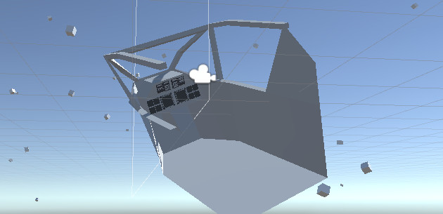

# Floating Cockpit

A kinda novel alternative ~~solution~~ workaround to the problem of floating point errors in flight simulator style games.

Made in Unity version 2018.2.21f1

## Download

You can either clone the repository or [download the asset package](https://github.com/brihernandez/FloatingCockpit/raw/master/FloatingCockpit.unitypackage) located in the root.

**Important!** If importing the asset package, you must create a `Cockpit` layer (Preferably on Layer 9) for this to work 100% correctly. It'll still work without it, but you will see rendering glitches.

## The Problem

Floating point precision errors suck. However, until Unity decides to add a switch for double precision Transforms/Physics, developers will continue to have to work around it.

This project demonstrates a slightly different approach to working around the problem. A highly detailed cockpit is more susceptible to these kinds of errors than the whole plane. In my experience, cockpits tend to have a limit of only 15-20km before they start shaking apart. Planes/spaceships however are often okay out to 100-200km depending on the mesh and design.

The ultimate workaround for this problem will still be a floating origin, however those come with their own quirks that for one reason or another you might not think is worth the hassle. To me a floating origin is a weapon of last resort. It'll probably solve your problem, but it can complicate things quite significantly, especially in a MP game.

## The Floating Cockpit

I came up with this idea when I was working on [Cockpit](https://www.youtube.com/watch?v=tkR-pfMvSNQ). In that game I had a detailed cockpit, but couldn't fly far from the origin due to the floating point errors. I didn't need the maps to be *huge* though, 100km across would be fine, so I just needed a way to push the usable space out that far.

Here are the two dev posts I wrote back at the time for the original solution: [Post 1](https://why485.tumblr.com/post/111938986898/) | [Post 2](https://why485.tumblr.com/post/111939057648)

The idea is simple enough. Keep the cockpit itself at the origin, while the vehicle goes off and flies on its own. This requires two cameras: One which is still on the vehicle and acts normally, and a separate one in the cockpit which mirrors its every move. The cockpit itself should also rotate to mirror the movements of the real vehicle.

### Comparison to True Floating Origin

This is a bit of an unusual thing to do, and it creates its own set of headaches. Unlike a floating origin it's not a *real* solution to floating point errors, it just puts them off a little bit. As neat as I think this solution is, it has a limited set of practical applications.

Pros:
* Pushes out the usable space of a map in a game with a detailed cockpit
    * In my experience, this gives about an order of magnitude more usable space.
* Maximum precision available at all times in the cockpit geometry
* Using the `close fit` [setting for shadows](https://docs.unity3d.com/Manual/class-QualitySettings.html#Shadows) allows for ultra-sharp shadows in cockpit, while still having shadows out to >1km.
* Less headaches than a true floating origin

Cons:
* Unlike a real floating origin, this doesn't prevent floating point errors, it only pushes them off a bit
* Lighting between cockpit and outside world can sometimes be inconsistent
    * This can be worked around (see below) but it can be a hassle
* Layered camera setups can be problematic depending on your game
* Must be wary of the layers involved to prevent glitches

## Technical Details

### Cameras

As mentioned above, this uses a two camera system. The main camera that renders the out the window view still exist on the vehicle, while the cockpit camera is only inside the cockpit and renders only that cockpit.

### Layers

This solution makes heavy use of the layer system, something that I'm personally always hesitant to rely on. Managing the camera culling masks so that they render only the layers they need to is simple enough, but it becomes a bit more problematic with lights. You will also want to disable collisions between the cockpit layer and the outside world in the Physics settings page.

### Lighting

Managing the lighting with this solution can be a bit tricky depending on the lighting setup of your game. If you have only one important light source (the sun) as many flight/space games do, then it's not too bad.

Since the cockpit sits at the origin of the world, any light which points at or moves near the origin will light the cockpit. For example if you have glowing bullets that happen to pass by the origin, the cockpit will seem to mysteriously light up as if from nowhere. Similarly, the cockpit can receive shadows from anything that blocks the sun at the origin, which again will look strange and not be consistent.

To solve these problems you need to use the culling masks on lights. (This is also visible in the demo project.) For example, there is a regular sun, and a separate sun that only affects the cockpit. The two lights excluding everything prevents shadows being casted on the origin from affecting the cockpit. You will also want to get into the practice of making sure any "outside" light you create is set to ignore the `Cockpit` layer, and any "inside" light is set to only affect the `Cockpit` layer.

Another lighting sitatuation to be aware of is when the vehicle moves into shadow. In the past I worked around this by doing a raycast from the vehicle camera to the sun, and if anything blocks it then I turned off the cockpit light. This works well enough, but you can no longer have partial shadows in the cockpit. It's all or nothing.

Again, how much of an issue this is depends on your lighting setup. In most flight/space games this isn't too difficult a thing to manage due to the very simple lighting they often have.
